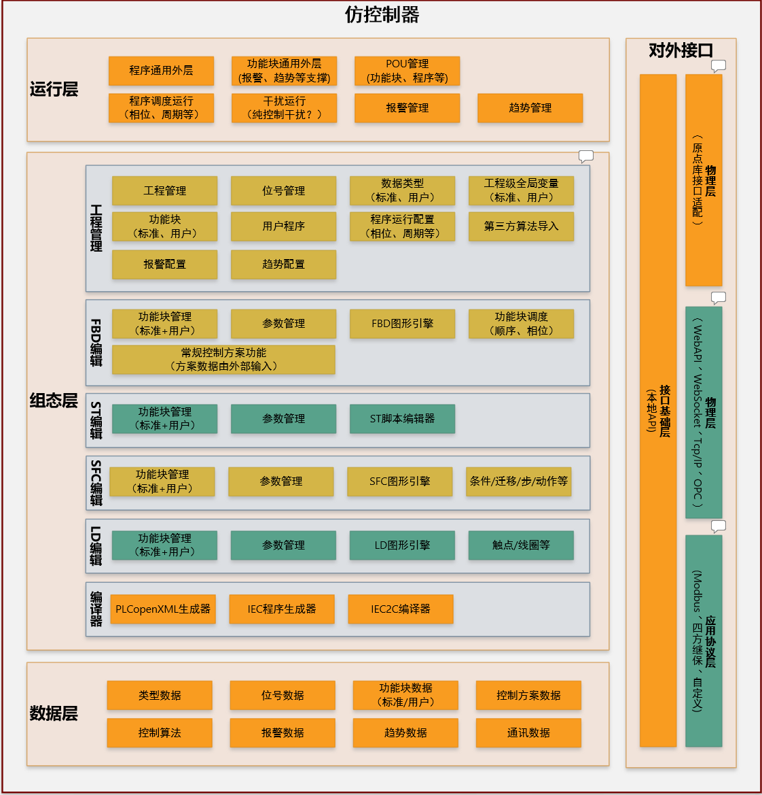
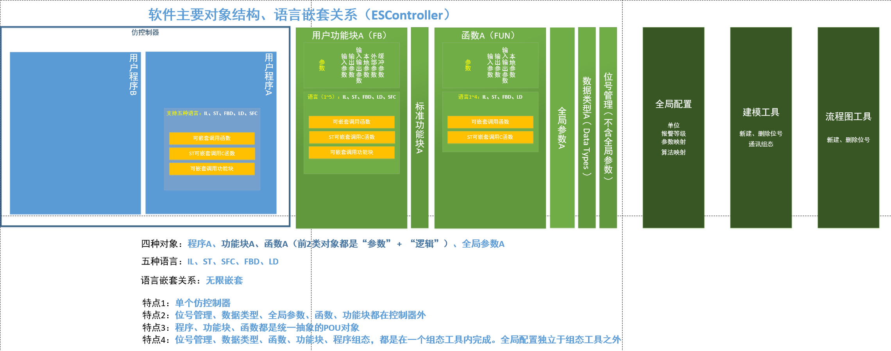

# 类 OpenPLC Editor 桌面组态工具 — 架构设想

本文档基于：

- `docs/assets/function_block.png`：ESController / IEC 61131-3 对象与语言嵌套关系；
- `docs/assets/project_architecture.png`：**仿控制器** 分层总架构（运行层 / 组态层 / 数据层 / 对外接口）。

技术栈：**Rust（N-API 后端）+ Electron + Vue**；图编辑 **AntV X6**；文本编辑 **Monaco Editor**。

> **路径说明**：下图使用相对路径引用 `docs/assets/` 下文件；若在 IDE 或 GitHub 中预览 Markdown，可直接显示。

---

## 1. 总架构图（仿控制器分层）

*图：组态层中含工程管理、各 IEC 编辑器与编译器；工程管理对应 Electron 主窗口，各编辑器对应子窗口。*

下图语义概括自上图，用于和模块边界、窗口划分对齐。

| 层次 | 职责摘要 |
|------|----------|
| **运行层** | 程序/功能块外层执行环境；调度（阶段、周期等）；POU / 报警 / 趋势等管理；扰动运行等。面向**控制器运行时**。 |
| **组态层** | **工程管理**（项目与用户程序、位号、数据类型、全局变量、执行配置、第三方算法、报警与趋势配置等）；各 **IEC 编辑器**（FBD / ST / SFC / LD，含公共的功能块与参数管理）；**编译器**（PLCopen XML、IEC 程序代码、IEC2C 等）。面向**本桌面工具的主工作区**。 |
| **数据层** | 类型、位号、功能块、控制方案、算法、报警、趋势、通讯等数据的统一承载，与组态/运行两侧模型对应。 |
| **对外接口** | 物理层、接口基础层（WebAPI / WebSocket / TCP/IP / OPC 等）、应用协议层（Modbus、四方继保、自定义协议等）。 |

**组态层**中的 **工程管理** 与 **各语言编辑器**在职责上相互独立：前者管「工程与资源组织」，后者管「单 POU / 单图的编辑体验」。这与下文的 **Electron 多窗口**划分一致。

---

## 2. 产品边界（来自 function_block 示意图）

*图：Program / FB / FUN 与全局参数、数据类型、位号及外围工具的关系。*

示意图强调四类核心对象及关系：

| 对象 | 含义（实现时需统一为 POU 抽象） |
|------|----------------------------------|
| 用户程序（Program） | 控制器内可调度单元，多语言体 + 参数 |
| 功能块（FB） | 可带内部状态；参数含 In/Out/InOut/Local/External/Buffer 等 |
| 函数（FUN） | 无持久内部状态；通常不允许用 SFC 作为实现语言（与图一致） |
| 全局参数 / 数据类型 / 位号 | 在「控制器实例」外统一建模，由组态工具集中管理 |

关键结论：

1. **单软控制器**：运行时视角是一个逻辑控制器，内含多个 Program。
2. **库与实例分离**：位号、数据类型、全局参数、FUN/FB 定义等可复用；具体绑定在组态工具内完成。
3. **POU 统一模型**：Program / FB / FUN 在元数据层统一，差异通过类型与语言可用集合表达。
4. **语言嵌套**：编辑器侧支持多语言体与调用关系；数据模型上可对嵌套深度设工程上限。

---

## 3. Electron 窗口模型（已定）

与总架构图中 **组态层** 的拆分方式对齐，采用：

| 窗口 | 职责 | 技术映射 |
|------|------|----------|
| **主窗口（Main Window）** | **工程管理**：项目与用户程序、位号管理、数据类型（标准/用户）、工程级全局变量、执行配置（阶段/周期）、第三方算法导入、报警与趋势等组态入口。 | 单个 `BrowserWindow`，加载 Vue 壳（项目树、列表、属性、导航到打开编辑器等）。 |
| **子窗口（Child Windows）** | **各 IEC 编辑器**：FBD、ST、SFC、LD 等各自独立编辑界面；公共能力包括标准/用户功能块管理与参数管理（按图可在各编辑器内呈现或共享组件）。 | 多个 `BrowserWindow`，按打开的 POU/资源创建；图语言（FBD/LD/SFC）使用 **X6**，ST（及 IL 等文本）使用 **Monaco**。 |

**设计要点：**

1. **主窗口不承载完整画布/Monaco 编辑区**（或可仅做轻量预览），避免与「独立子窗口编辑器」职责重叠。
2. **子窗口生命周期**：从主窗口「打开某 POU / 某语言视图」创建；关闭前通过 IPC 提示保存；同一 POU 重复打开策略（单实例复用 vs 多实例）需在 `docs/specs/technical/` 明确。
3. **主进程**：维护窗口注册表（`windowId` ↔ 工程内对象 id / 编辑器类型）、统一下发工程状态与后端调用；**preload** 暴露安全 IPC。
4. **渲染进程**：主窗口与子窗口可**共用同一 Vue 构建产物**，通过 URL hash/query（如 `?role=editor&lang=fbd&pouId=`）或独立 `entry HTML` 区分布局；子窗口仅挂载对应编辑器布局，减少无关依赖。

---

## 4. 与当前仓库结构的映射

| 层级 | 现状 | 目标职责 |
|------|------|----------|
| `packages/frontend` | Vue 3 + 路由（当前仅算法管理） | **主窗口**：工程管理 UI；**子窗口**：各编辑器路由/入口与专用布局；共用组件（项目 API、POU 元数据表单等）。 |
| `packages/desktop` | Electron 主进程、preload、IPC | **多窗口**：创建/关闭子窗口、焦点与菜单、窗口间消息；`initDb` 与 Rust 调用；可选本地工程目录。 |
| `packages/backend` | Rust N-API、MySQL | 工程与 POU、图与源码持久化、校验；**编译器**（PLCopen XML / IEC / IEC2C）与运行层对接可逐步落地。 |

新增前端依赖（实现阶段写入依赖清单）：`@antv/x6`、`monaco-editor`（或官方推荐封装）。

---

## 5. 技术选型落地

### 5.1 图编辑 — AntV X6

- **适用**：子窗口中的 FBD、LD、SFC（步骤/转移/动作等专用图元）。
- **实践要点**：自定义 Node/Edge、与领域模型同步；持久化以结构化图模型为主，避免强绑 X6 私有 JSON。

### 5.2 代码编辑 — Monaco Editor

- **适用**：子窗口中的 ST、IL 等；**每个子窗口**可挂载一个或一组 Monaco 实例（按页签拆分 ST 段时再做细化）。
- **集成**：与 POU id、语言类型绑定；Monarch 高亮与后续诊断管线可渐进增强。

### 5.3 后端 — Rust

- N-API + MySQL：与数据层、组态内容一致；编译与下装管线可对照组态层「编译器」模块分阶段实现。

### 5.4 运行层与对外接口

- **运行层**能力（调度、报警、趋势、扰动等）多在控制器侧；本仓库若先做组态工具，可通过 `docs/roadmap/` 划分「仅组态」与「联调运行时」阶段。C++ 运行层模块与组态编译衔接、外部读取功能块数据等详见 [**C++ 运行层说明**](./cpp_runtime_desc.md)。
- **对外接口**（OPC、Modbus 等）与 Electron 主进程或独立服务的关系在 `docs/specs/technical/` 中单独立项，避免与编辑器窗口模型耦合。

---

## 6. 实现路径（与多窗口策略的关系）

此前「单 SPA 多路由」方案（仅文档中旧称 A）适合**快速验证**；**与总架构及窗口定案一致的主线**应为：

| 方案 | 内容 | 说明 |
|------|------|------|
| **主线（推荐）** | 主窗口 = 工程管理；子窗口 = 各编辑器 | 与 `project_architecture.png` 组态层拆分一致，利于并行开发与窗口级资源隔离。 |
| **过渡** | 主应用内临时用路由模拟子窗口 | 仅开发期可选，避免长期与交付形态不一致。 |

前端目录建议按 **主窗口 / 子窗口编辑器** 拆分特性模块（如 `features/project-shell`、`features/editors/fbd`），避免与「单页多编辑器」混在同一巨型布局中。

---

## 7. 文档与配图落位

| 主题 | 建议路径 |
|------|----------|
| 业务需求与范围 | `docs/requirements/` |
| 多窗口 IPC、POU 打开策略 | `docs/specs/technical/` + `docs/api/` |
| POU / 语言规则 | `docs/specs/business/`、`docs/specs/technical/` + `docs/glossary/` |
| 关键架构抉择 | `docs/adr/` |
| 总览与配图 | `docs/architecture/technical/`（本文）+ `docs/assets/`（推荐存放架构图） |

---

## 8. 待确认事项

1. **MVP 范围**：是否先实现主窗口工程管理 + FBD/ST 子窗口 + 持久化，SFC/LD 后置？
2. **运行时**：当前是否仅组态工具，还是已需对接仿控制器运行层或下载/调试协议？
3. **子窗口技术形态**：倾向「同构建多入口 HTML」还是「单入口 + query 区分」？（实现前在 `docs/adr/` 记一条决策即可。）

定稿后可在 `docs/requirements/` 写 PRD 条目，在 `docs/roadmap/` 拆阶段里程碑。
