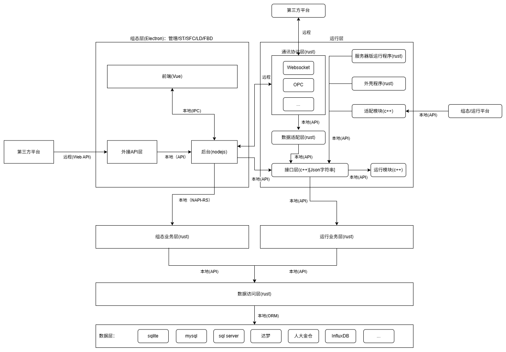

# 总体结构图说明（overall_structure）

## 1. 配图

> 图片来源：`docs/assets/overall_structure.png`

---

## 2. 图示目标

该图描述了组态工具与运行侧的整体协作关系，核心是将系统拆分为三条主线：

1. **组态层（Electron + Vue + Node/Rust）**：负责工程管理与编辑体验（ST/SFC/LD/FBD）。
2. **运行层（Rust + C++）**：负责运行时适配、通讯协议与运行模块。
3. **数据访问层（Rust）**：统一访问多种数据库（SQLite、MySQL、SQL Server、达梦、人大金仓、InfluxDB 等）。

---

## 3. 关键模块解读

## 3.1 组态层（左侧）

- `前端(Vue)`：承载 UI 与编辑器交互。
- `后台(nodejs)`：本地 API 聚合层，与前端通过本地 IPC / API 交互。
- `组态业务层(rust)`：通过 NAPI-RS 与 Node 层打通，承担组态域核心逻辑。
- `外类API层`：与第三方平台进行远程 Web API 通信。

## 3.2 运行层（右侧）

- `通讯协议层(rust)`：抽象 WebSocket、OPC 等协议接入。
- `数据适配层(rust)`：运行数据模型与外部协议/模块之间的适配。
- `接口层(c++)[Json字符串]`：Rust 与 C++ 运行模块之间的本地 API 边界。
- `运行模块(c++)`：控制逻辑执行核心。
- `服务器运行程序(rust) / 外壳程序(rust)`：运行侧进程管理与服务承载。
- 外部连接：与第三方平台、组态运行平台通过本地/远程 API 联通。

## 3.3 数据层（底部）

- `数据访问层(rust)` 作为统一 ORM/访问入口。
- 下接多数据库类型，意味着系统设计目标是**驱动可扩展、业务模型统一**。

---

## 4. 当前仓库映射（建议）

结合现有仓库可按以下方式落位：

1. `packages/frontend` 对应图中的前端 Vue 区域。
2. `packages/desktop` 对应 Electron 主进程、IPC 与 Node 聚合逻辑。
3. `packages/backend` 对应 Rust 业务层/数据访问层（逐步补齐运行层对接能力）。

---

## 5. 与交付阶段的对应关系（示意）

本图用于理解组态主链路与运行侧关系，可按阶段裁剪落地：

1. 主窗口工程管理 + 子窗口编辑（FBD/ST）。
2. 本地 SQLite 持久化（具体范围以 `docs/requirements/`、`docs/roadmap/` 当前基线为准）。
3. 暂不接入完整运行层联调与编译导出时，可先只落地左侧组态主链路。

运行层相关模块在目标范围确认后再扩展。

---

## 6. 后续维护约定

1. 每次调整跨层调用关系（IPC、本地 API、远程 API），同步更新本文件与配图。
2. 新增协议或数据库类型时，同时补充 `docs/api/` 与 `docs/specs/technical/` 的契约/实现细节。
3. 若 `接口层(c++)` 的数据格式从 JSON 字符串升级为结构化协议（如 Protobuf），需新增 ADR 记录。
