# 功能块组态用户故事v3

> 本文件由 DOCX 自动提取生成，图片已导出到同级目录。

OTS项目开发流程

OTS项目开发，一般由项目负责人、组态工程师两个角色来开发，流程如下图所示。目前，大多数情况下，两个角色分别由两个人来承担。有时也由一个人承担。
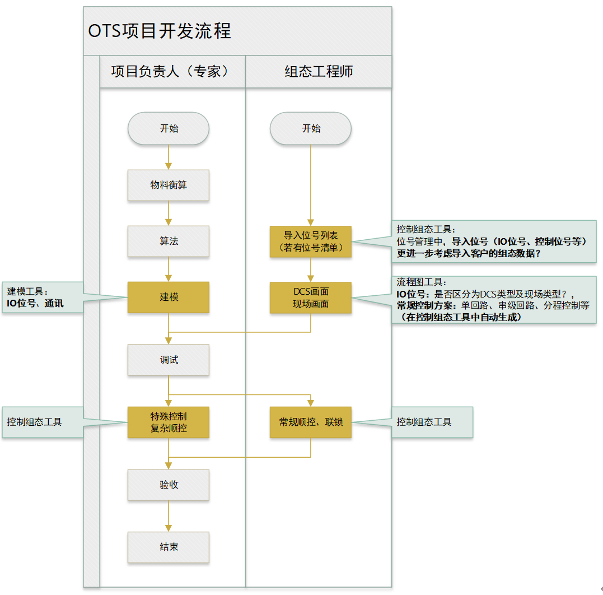

建模工具中组态IO位号

项目负责人，在建模工具中组态通讯时，若IO位号不存在，就新建位号。

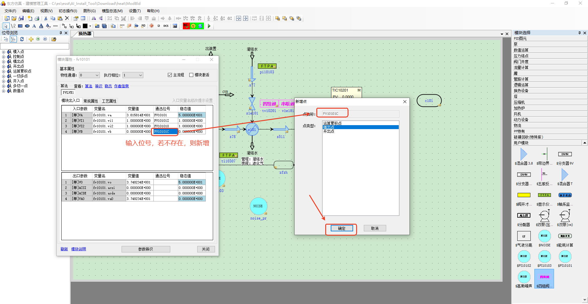

控制组态工具中导入位号

组态工程师，在客户提供了仪表位号清单材料后，可以在控制组态工具中直接导入位号。当有功能块位号，直接生成到用户程序图中。如下所示。

后续考虑直接导入客户的控制组态程序？

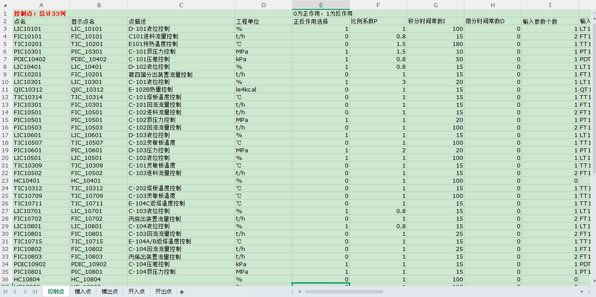

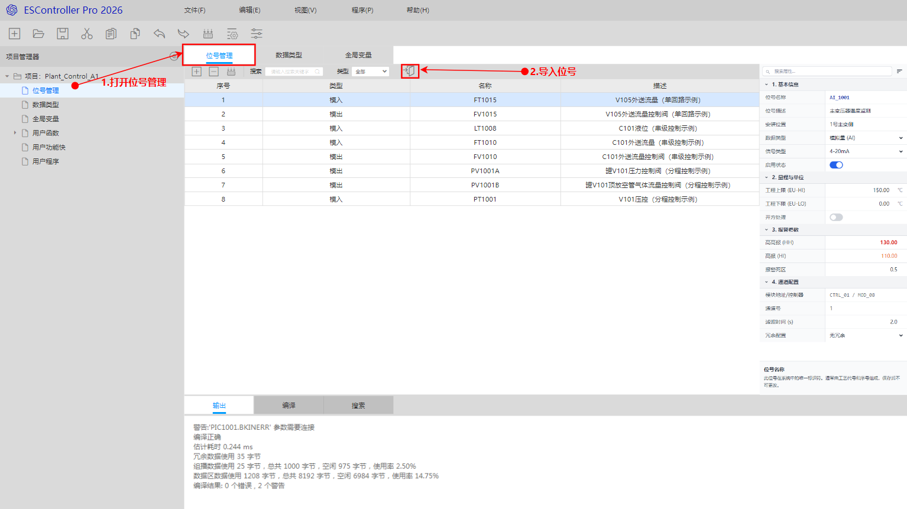

流程图工具组态位号

组态工程师，在组态DCS画面时，若位号不存在，则会创建位号。

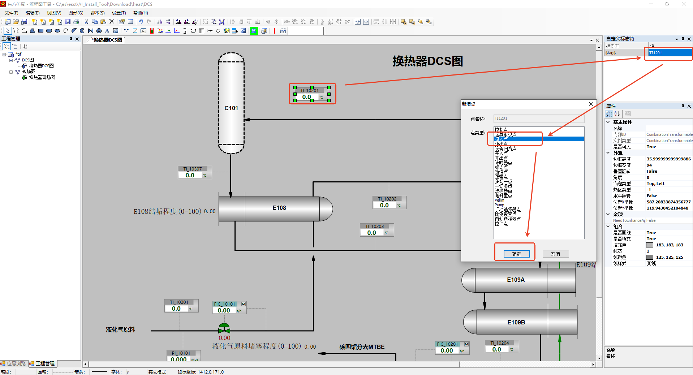

组态工程师，在组态DCS画面时，若需要常规控制回路，可以一键创建常规控制回路，如下所示，以串级控制回路为例：

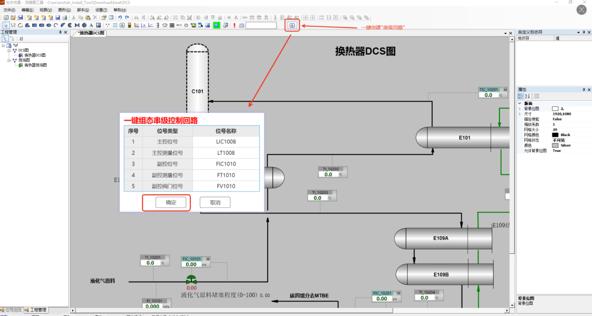

控制组态工具（常规控制回路）

用户场景描述

场景描述：在控制组态工具中，组态常规控制回路。

开发工程师要组态:

一个单回路控制（流量）FIC1015。

一个串级控制（液位、流量）LIC1008、FIC1010。

一个分程控制（通过入原料阀、出原料阀控制设备压力）PIC1001。

如下图所示：

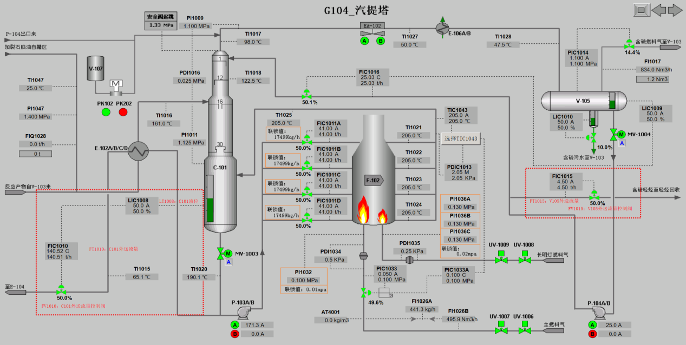

图1 单回路控制、串级控制

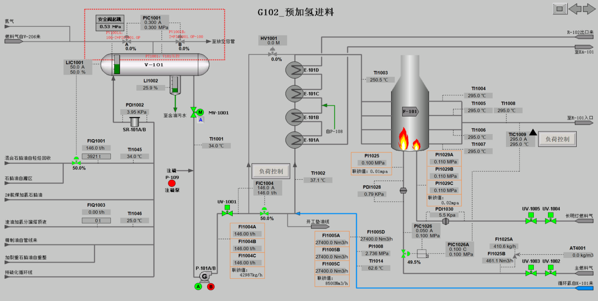

图2 分程控制

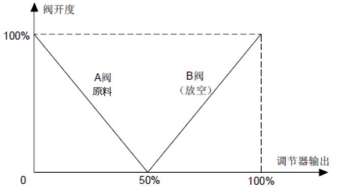

图3 分程控制曲线

组态主要流程

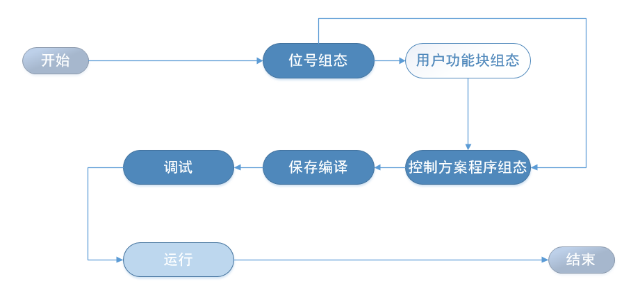

位号组态：创建、删除模入、模出、开出、开出等位号。完成位号的有效性检查。

用户功能块组态：如系统功能块不足以满足用户需求，用户根据特定工艺要求自行组态功能块，以便复用此功能块的逻辑。可以跳过该步。

控制方案程序组态：用户根据控制工艺要求，从系统模块中选择功能块，进行控制程序组态。

保存编译：控制方案程序组态完后，可以一键完成控制方案的保存、检查与编译。

调试：测试组态效果是否符合期望的逻辑，通过运行、暂停（手动、断点）控制程序，通过监视参数或位号值，完成对控制方案程序的调试。

运行：将控制程序和工艺模型放到一起，在学员站（运行平台）中运行。

针对以上场景的用户故事

启动控制组态：和现有的工具一样，在“项目管理”中启动控制组态。

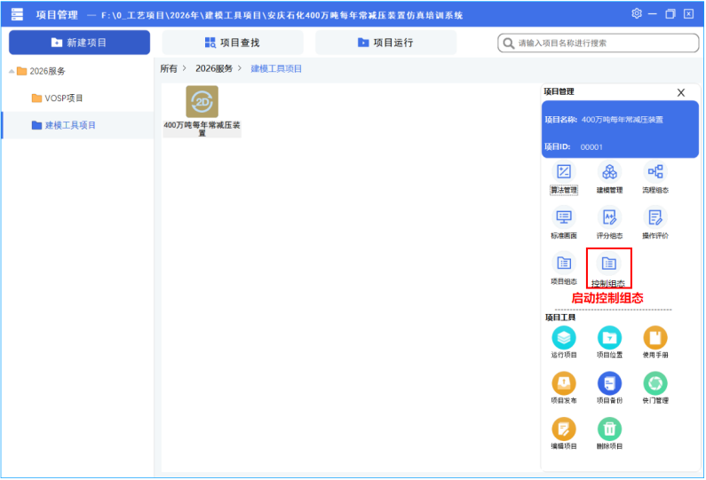

新建项目：和现有的工具一样，如果本项目第一次进行控制系统组态，需新建控制项目，选择+号按钮即可新建。否则，直接打开已建立的控制项目。

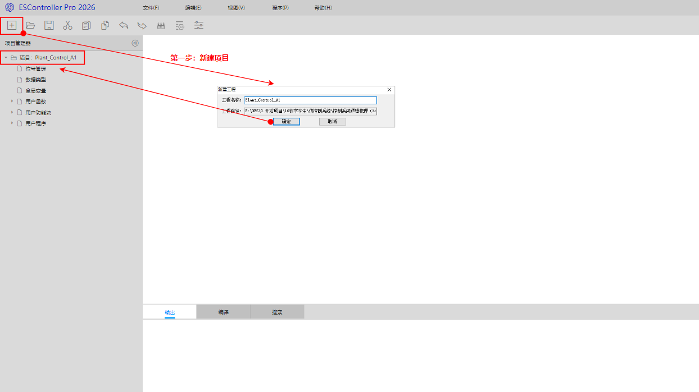

创建位号

创建单回路的模入、模出位号：

FT1015，V105外送流量；

FV1015，V105外送流量控制阀。

创建串级回路的模入、模出位号：

LT1008，C101液位；

FT1010，C101外送流量；

FV1010，C101外送流量控制阀。

创建分程控制的模入、模出位号：

PT1001，V101压控；

PV1001A，罐V101压力控制阀；

PV1001B，罐V101顶放空管气体流量控制阀。

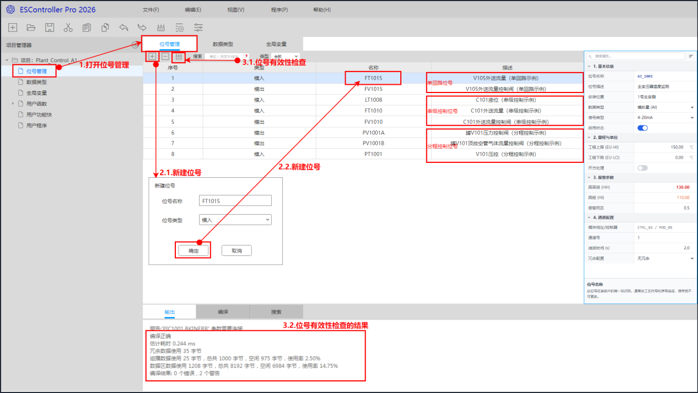

也可以在模型工具、流程图工具中新建模入、模出、开入、开出位号。如下图所示：

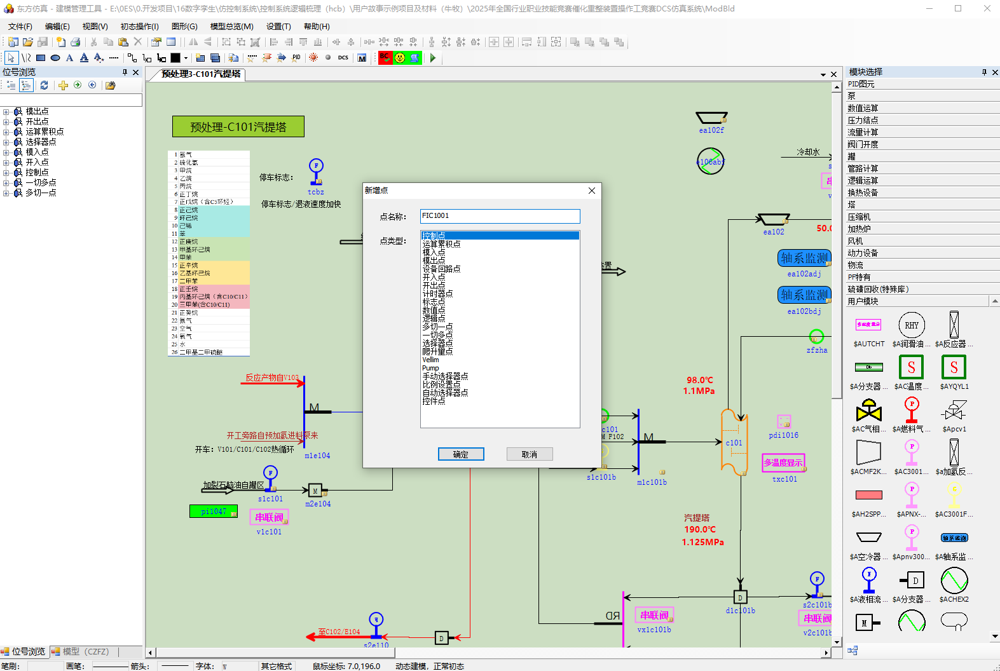

用户功能块组态

本案例不需要，先略过。

控制方案程序组态

单回路简单如图所示。主要以串级控制为例，如下：

首先新建用户程序program1。

周期：程序周期。可选择有快周期、1倍、2倍、5倍、10倍，快周期程序不可设置相位；

起始相位：设置起始相位是为了分配控制器在各相位下程序运行负荷而设置的功能，各程序按照所设置的起始相位循环运行。可设置的相位0~9可选。

优先级：同相位程序的优先级，分低、中、高三级。

拖动创建2个PID功能块，分别是FIC1010，LIC1008。

拖动创建3个位号引用（模入模出），分别是LT1008、FT1010、FV1010。

建立连接关系，如图所示。

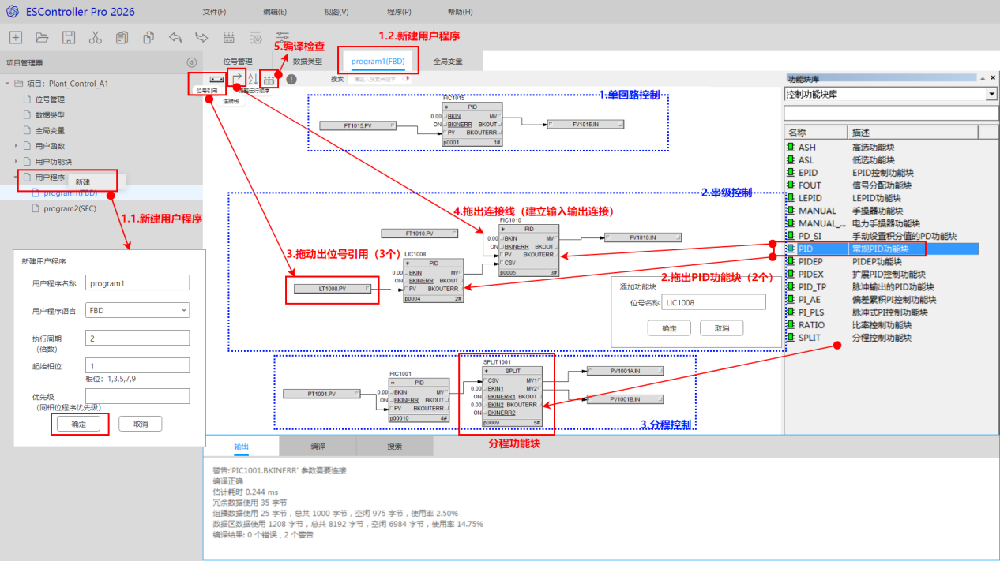

分程控制位号SPLIT1001，需要做特殊设置如下：

操作动作1下限~上限设为0~50，输出1正反作用设置为反作用。

操作动作2下限~上限设为50~100，输出2正反作用设置为正作用。

保存及编译

一键完成控制方案的保存与编译，如有编译提示问题，进一步修改再保存编译。

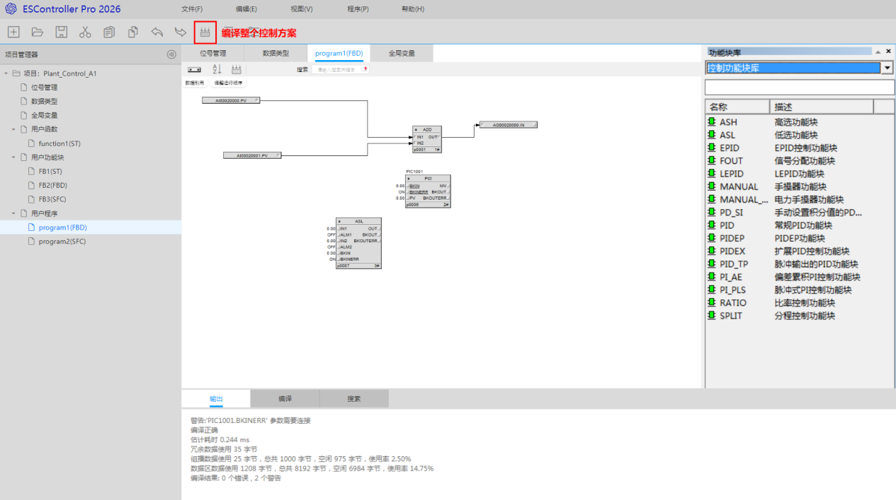

调试

通过运行、暂停（手动、断点）控制程序，通过监视参数或位号值，完成对控制程序的调试。

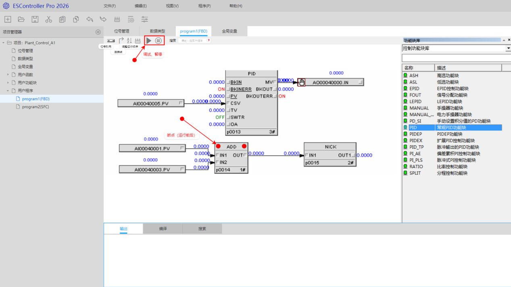

运行

启动学员站运行。

控制组态工具（顺控）

通过拖入创建‌步（Step）、动作（Action）、‌转换条件（Transition Condition）、‌初始步（Initial Step）、‌顺控器结尾（End of Sequencer）、‌跳转指令（Jump Instruction）、‌选择分支（Selective Branch）、‌并行分支（Parallel Branch）等顺控元素来创建顺控图。

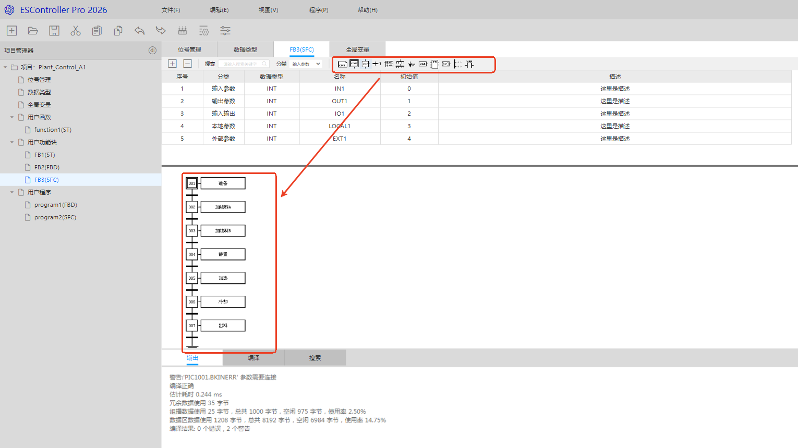

控制组态工具（联锁）

联锁逻辑，从右侧拖入逻辑功能块，完成联锁逻辑的创建。

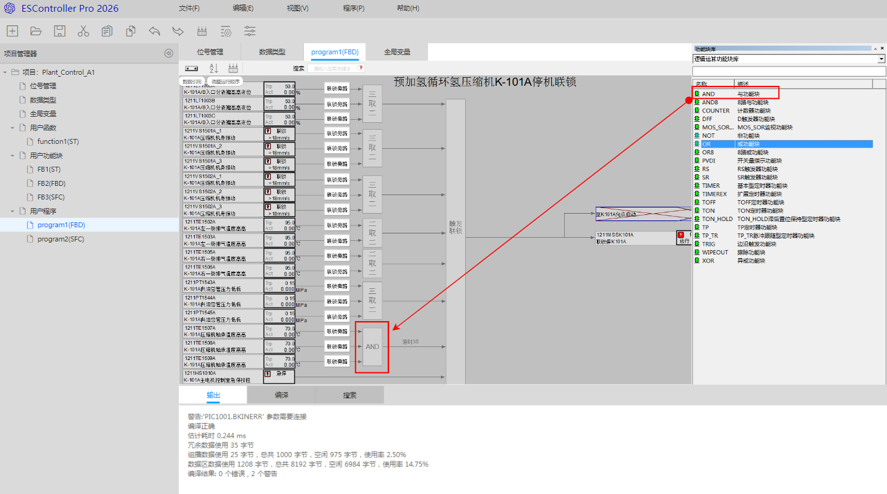

## 附录：未定位到正文锚点的提取图片

以下图片已从原始 DOCX 提取，但在自动解析过程中未定位到明确正文位置（通常为矢量图、页眉页脚或对象嵌入）：

